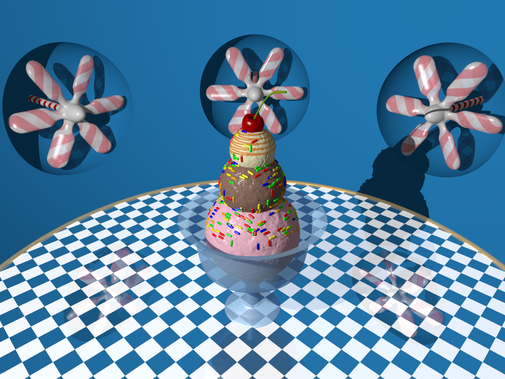

# 3D Renders
 
A collection of 3D renders created using [POV-Ray](https://www.povray.org/).

The individual rendered frames are not included for any animations. Use the `BuildVideo.bat` batch file to generate a video after rendering every frame using POV-Ray. This script assumes that [`ffmpeg`](https://www.ffmpeg.org/) exists in the PATH.

## Gallery

This section showcases the rendered scenes and animations.

### Ice Cream Factory (1024x768)

Click on the image to view the animation.

## Tools And Resources 

This section lists some useful tools and resources that were used to create each scene.

* [POV-Ray 3.7 Documentation](https://www.povray.org/documentation/3.7.0/).

* [POV-Ray Tutorials Sorted By Popularity](https://www.povray.org/resources/links/3D_Tutorials/POV-Ray_Tutorials/).

* [Friedrich A. Lohmüller's POV-Ray Tutorials](http://www.f-lohmueller.de/pov_tut/pov__eng.htm).

* [Mike Williams' Isosurface Tutorial](https://web.archive.org/web/20200129140707/http://www.econym.demon.co.uk/isotut/printable.htm).